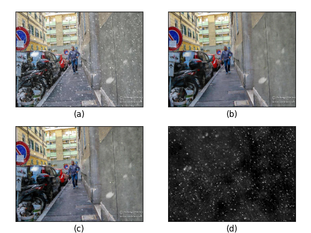

# DesnowNet: Context-Aware DeepNetwork for Snow Removal
This project is an unofficial code of the paper [DesnowNet: Context-Aware DeepNetwork for Snow Removal](https://sites.google.com/view/yunfuliu/desnownet).

## Example



(a) Snowy Image $x$ (b) Estimated snow-free output $\hat{y}$ (c) Estimated snow-free output $y'$ (d) Estimated snow mask $\hat{z}$

## Environment

To generate the recovered result you need:

1. Python3
2. CPU or NVIDIA GPU + CUDA CuDNN

The required packages can refer to requirements.txt.

## Model Checkpoints 

- create a log directory to save your checkpoints, e.g

  ```
  mkdir ./log
  ```

- Download the checkpoint via this [link][https://cloud.tsinghua.edu.cn/f/c98046656636404788be/?dl=1] and put it into the log directory

## How to use the code?

- Train

```python
  python3 train.py --device [Device] -r [Root path for training set] -dir [Checkpoints directory] -iter [Iterations] --save_schedule [Save Checkpoints]
```
- Test

```
  python3 Test.py --device [Device] -dir [Checkpoints directory] -root [Root path for test set] -path [Image Path] --checkpoint [The checkpoint you choose]
```
- Inference

```
  python3 inference.py --device [Device] -dir [Checkpoints directory] -path [Image Path] --checkpoint [The checkpoint you choose]
```

*train.py* will automatically choose the latest checkpoint and continue the training process. 

## The Improvements

### Two-stage training

- Train

```python
python3 multi_stage_train.py --device [Device] -iter [Iterations for training RG] -dir [Checkpoints directory] -r [Root path for training set] --save_schedule [Save Checkpoints] --TR_iterations [Iterations for training TR]
```
- Test, Inference:  It's the same with the original model.

### Predict the product of z and a

- Train

```python
python3 train.py --device [Device] -r [Root path for training set] -dir [Checkpoints directory] -iter [Iterations] --save_schedule [Save Checkpoints] --mode za
```
- Test

```
  python3 test.py --device [Device] -dir [Checkpoints directory]  -root [Root path for test set] -path [Image Path] --checkpoint [The checkpoint you choose] --mode za
```

- Inference:
```
  python3 inference.py --device [Device] -dir [Checkpoints directory] -path [Image Path] --checkpoint [The checkpoint you choose] --mode za
```

## Reference Code

 Pretrained models for Pytorch https://github.com/Cadene/pretrained-models.pytorch/blob/master/pretrainedmodels/models/inceptionv4.py

 pytorch-msssim https://github.com/jorge-pessoa/pytorch-msssim

